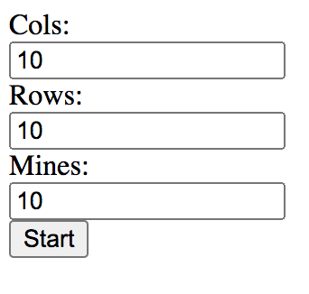
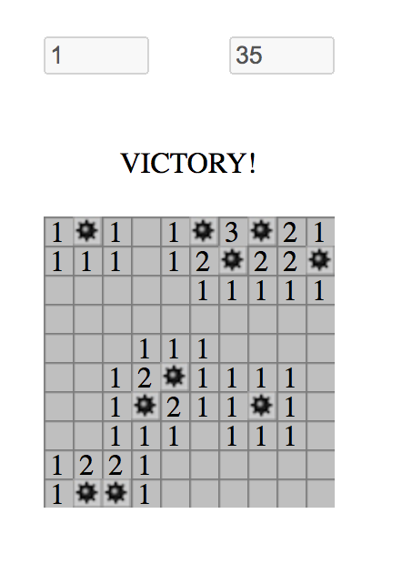
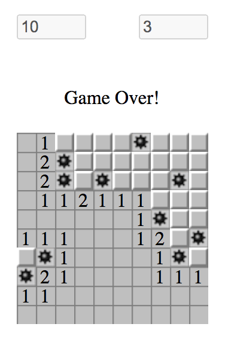

# Minesweeper

## Story

You work for a company that wants to recreate old built-in Windows games to make them playable in a Web browser.
One of your colleagues has started the implementation but he could only do the python part of the game. Now it's your turn to do the rest of the work!
It is important to have the same look and feel like in the good old [Windows XP Minesweeper](https://minesweeper.online/)!

## What are you going to learn?

You will learn and practice how to do the following things:

- handle user interactions with JavaScript event handlers
- find DOM elements by their class names / ids / data-attributes / any other kind of selectors
- change the found DOM elements' style / class name / any other attribute
- measure and show time with built-in JavaScript functions

## Tasks

1. Make field opening possible for players when they left click on any unopened field.
    - When player clicks on a field which has no mine, it should have an `open` style.
    - When player clicks on a field that has a mine, there should appear a mine icon.
    - Once a field is opened it cannot be closed again. (When user clicks on it nothing should happen.)
    - Flagged fields cannot be opened. (When user clicks on them nothing should happen, player must first remove the flag.)
    - When player clicks on a field which does not have a mine, there should appear a number (1-8) which means how many of its neighbors have mines. If there are no mines in it's neighboring cells, field should be empty ('0' does not need to appear), but it should have an `open` style.

2. Make mine flagging possible for the players when they right click on any unopened field.
    - When player right clicks on an unopened field a flag icon appears there.
    - When player right clicks on a flagged field flag disappears.
    - When player right clicks on the playfield context menu stays hidden.

3. Implement a counter that can count remaining unflagged mines.
    - The `#mine-left-counter` element counts remaining mines that have not been flagged.

4. Make it possible to win the game when player finds all mines.
    - When player opened all fields that don't have a mine, a message should appear about the fact of the victory.
    - After player won, game should not respond to clicks on the play field anymore.

5. Make it possible to lose the game if a player steps on a mine.
    - When player opened a field which contains a mine, a game over message should appear.
    - After player lost, all mines should be revealed.
    - After player lost, game should not respond to clicks on the play field anymore

6. [OPTIONAL] Implement a counter that can count elapsed time in the game.
    - The `#elapsed-time-counter` element counts elapsed seconds from the first click of the player on.
    - When player wins or loses the game elapsed time counter should immediately stop.

7. [OPTIONAL] Make field opening automatic when they have zero mines and are stacked together
    - When player clicks on a field which has no neighbors with a mine, game should automatically open its neighbors as well.
    - This algorythm should do this recursively until it reaches the border of the empty area (like in good old Windows XP Minesweeper).

## General requirements

None

## Hints

- You can open the `index.html` by starting a small HTTP server
  (see the background materials for details)
- Starter code contains a script that can render the initial state: 
  a play field with the given dimensions and the specified amount of random generated mines on it.
- For the logic you will need info like "which row/column did I click", "how many rows/cols are", ... 
  We suggest you to use the data attributes which the skeleton code generates out into
  `div.game-field` of game.html.
  It is a good technique to store interesting info in data attributes. 
  (eg. pass values from backend side (Python/Java/node.js/...) to frontend code (JavaScript).
- Icons (e.g. flag, mine, etc.) are present in the starter repo in the `img` directory.
- For the automatic area opening feature it's suggested to use a recursive function.

## Starting your project

## Background materials

- <i class="far fa-exclamation"></i> [How to start a local HTTP server](/pages/tools/serve-files)
- <i class="far fa-exclamation"></i> [Javascript - Events](/pages/javascript/javascript-events)
- <i class="far fa-exclamation"></i> [Javascript - DOM manipulation](/pages/javascript/javascript-dom)
- <i class="far fa-exclamation"></i> [Javascript - Debugging](/pages/javascript/javascript-debugging)
- <i class="far fa-exclamation"></i> [Javascript - Other features](/pages/javascript/javascript-other-features)
- <i class="far fa-video"></i> [The concept of recursion](https://www.youtube.com/watch?v=vPEJSJMg4jY)
